## Tolls
- Cloud Provider: AWS
- VCS: GitHub

## Steps
1) ### Create GitHub Repo (with some crud app)
2) ### Create ECR (Elastic Container Registry) for string all your artifact
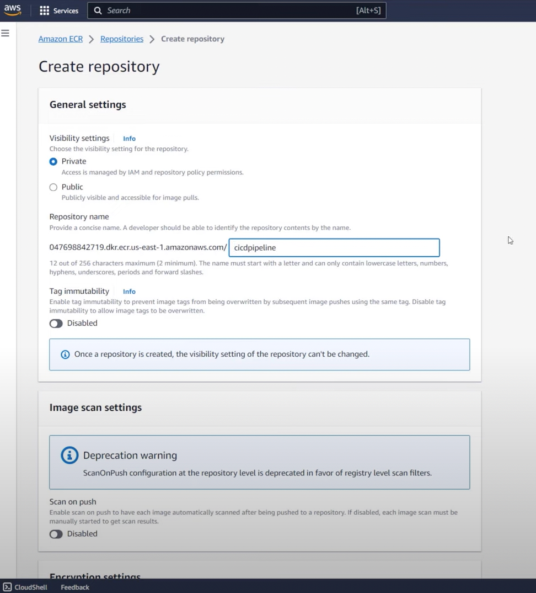
3) ### Developer Tolls -> create CodeBuild to connect your github repository to aws (via OAuth or access token)
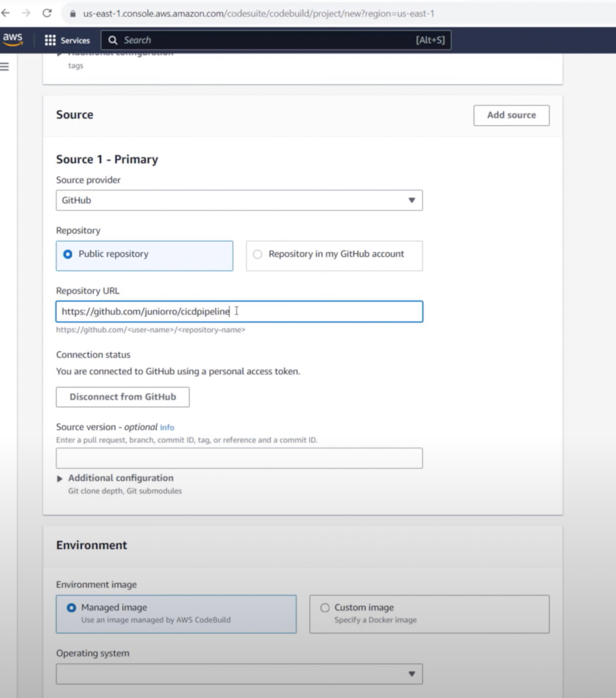
4) ### add to your code `buildspec.yml` file, something like [buildspec.yml](example%2Fbuildspec.yml) 
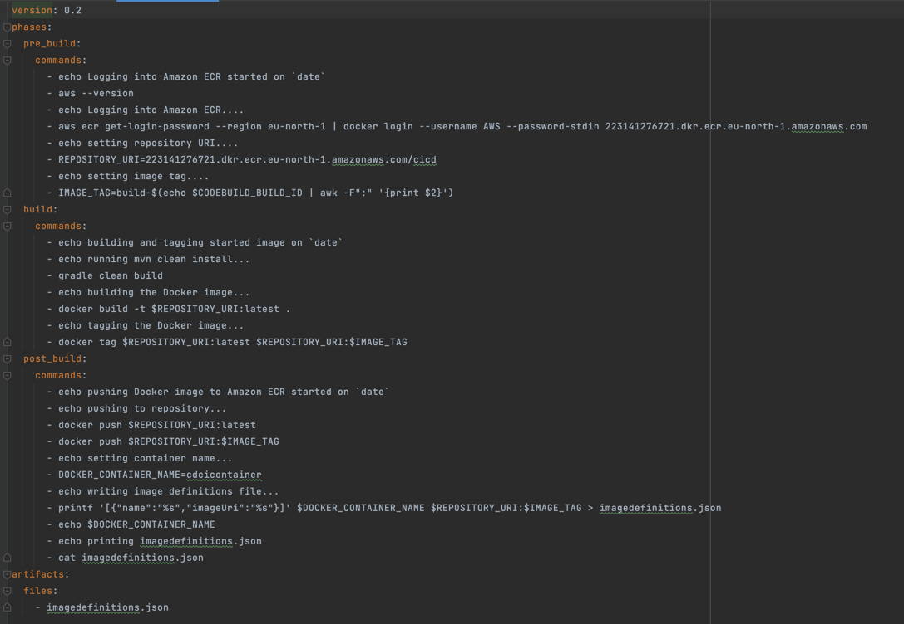
5) ### add IAM permission policy for ECR
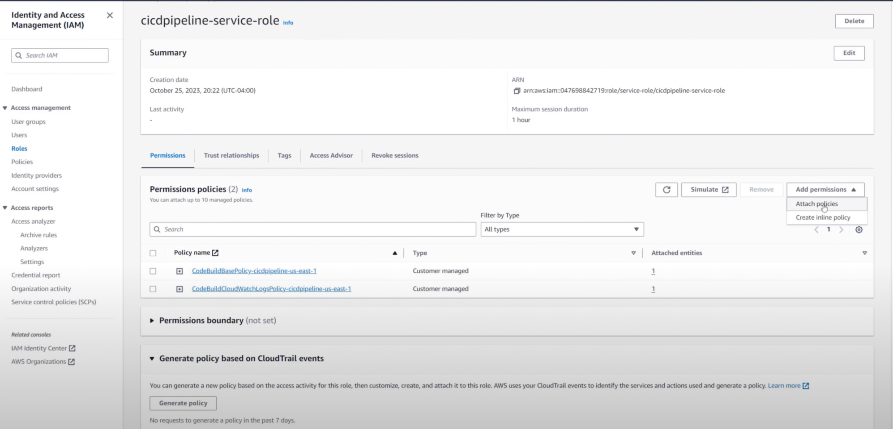
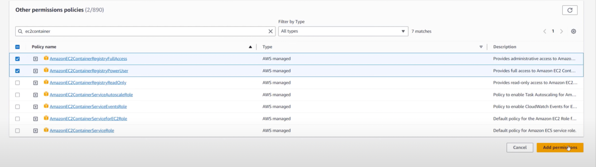
6) ### Create ECS (Elastic Container Service) Cluster
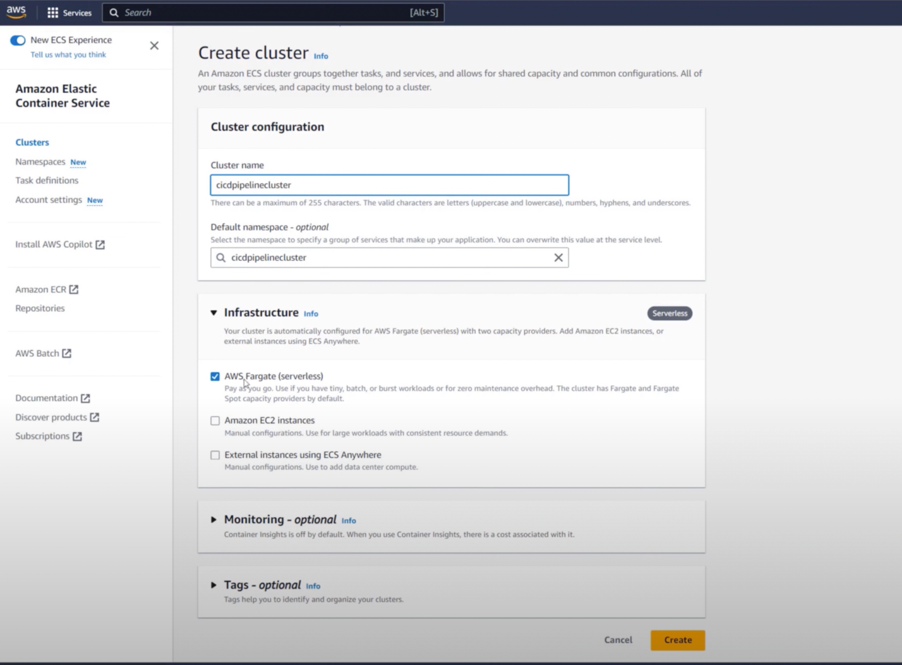
7) ### Create Task Definition for your ECS
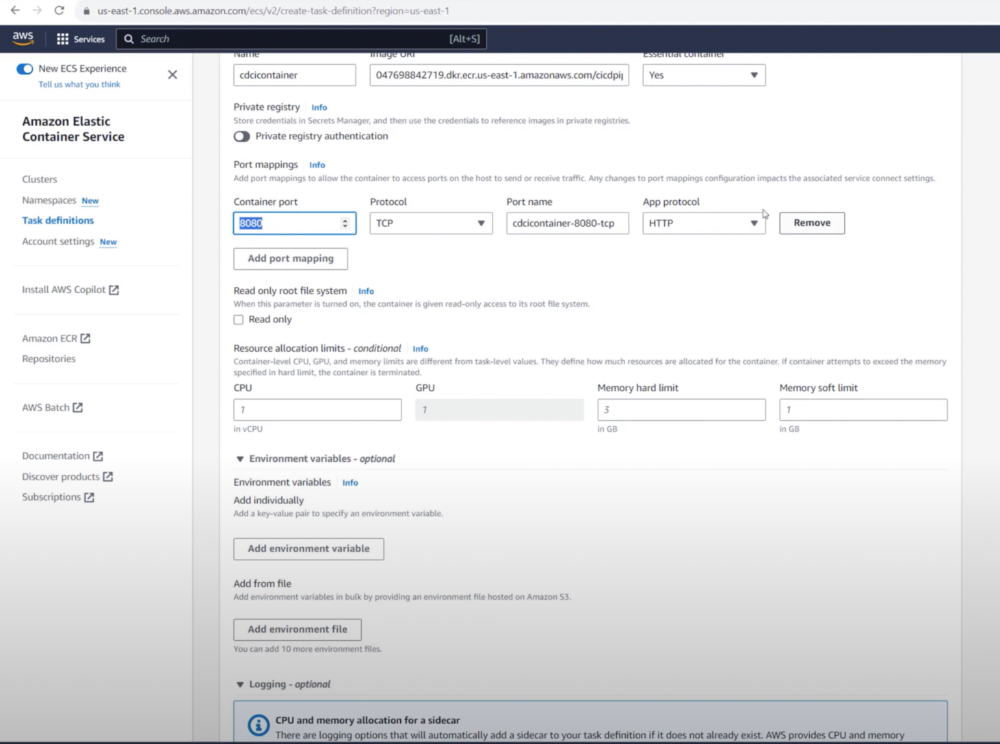
8) ### go back to cluster -> create Service, but when you rich the loadBalancer chapter execute 9 and 10 steps, ones you will be done with it chose the one you have created LB
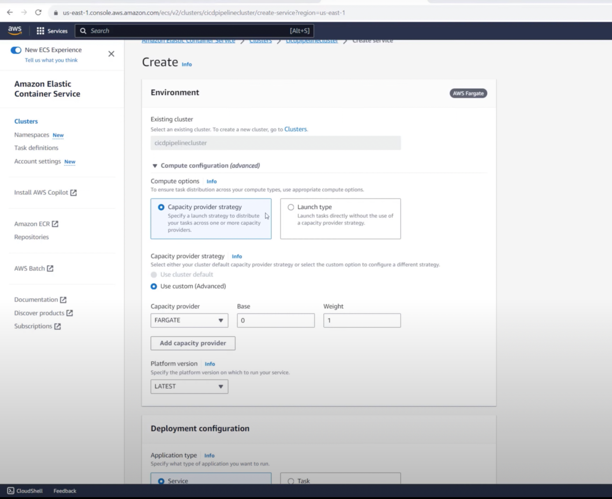
9) ### Create target group 
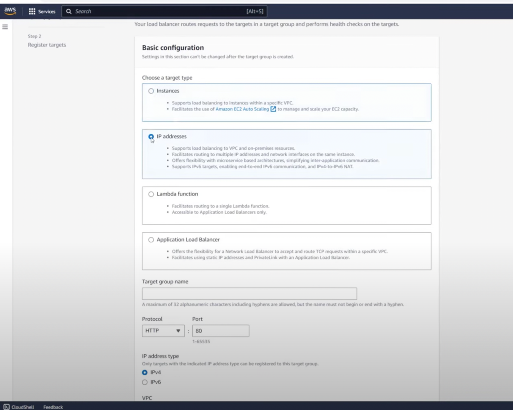
10) ### Create Load Balancer
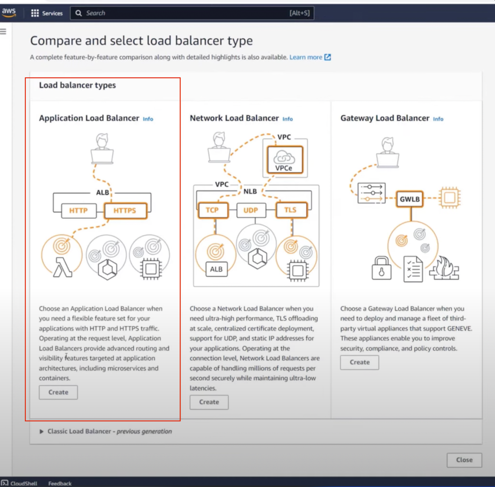
11) ### Add new Security Rule in EC2 instance, go to EC2 -> Security Group -> default
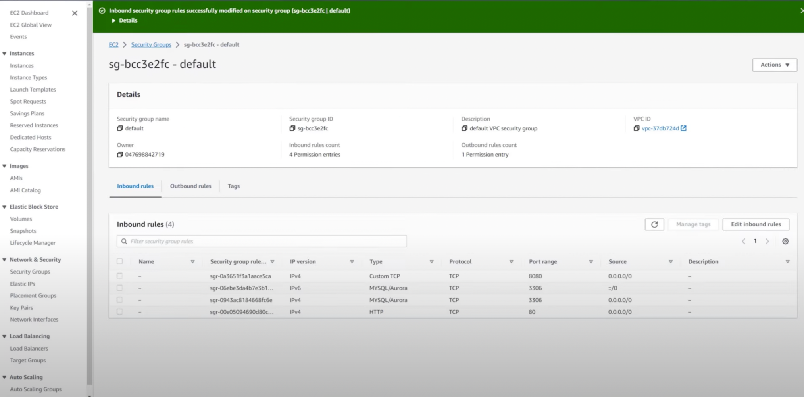

