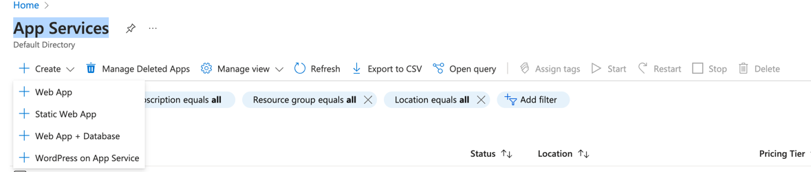
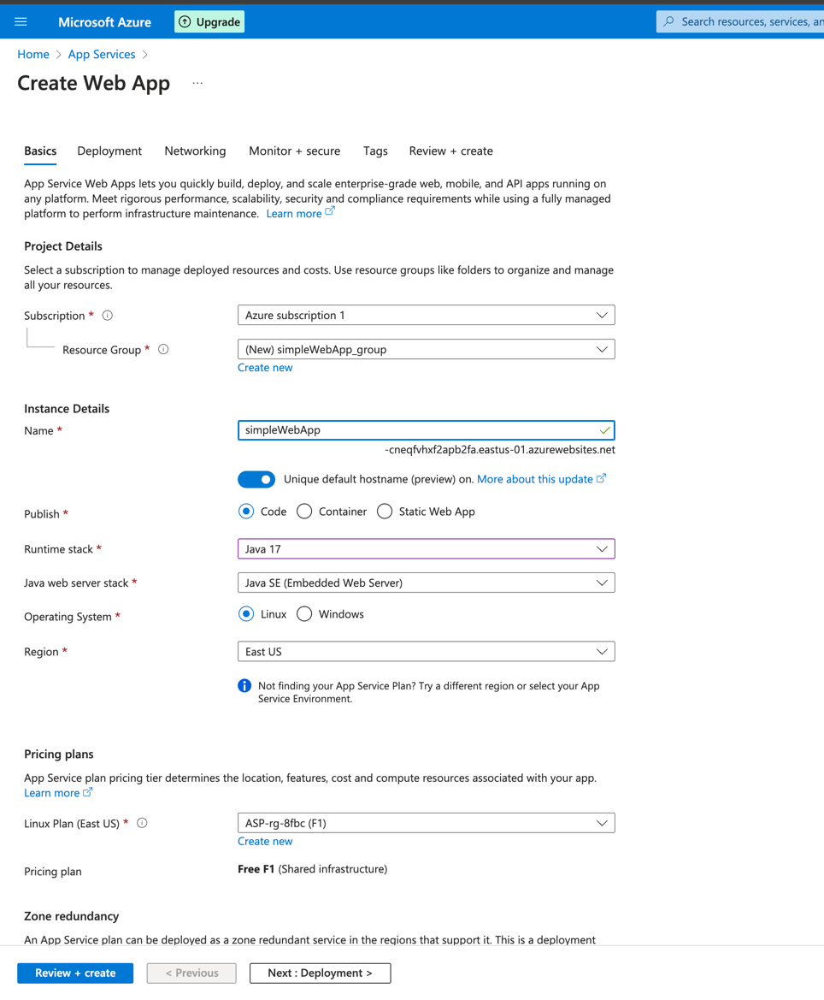
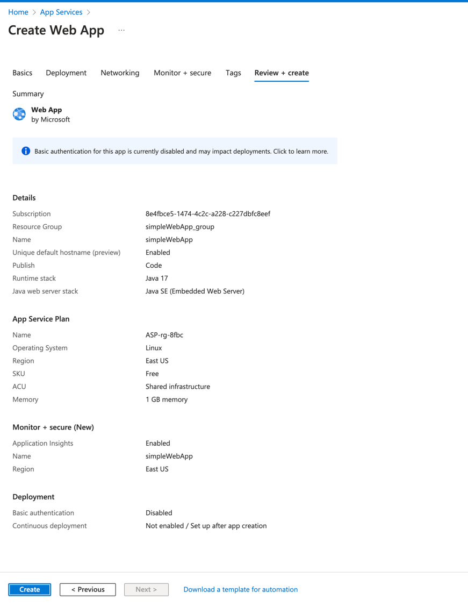
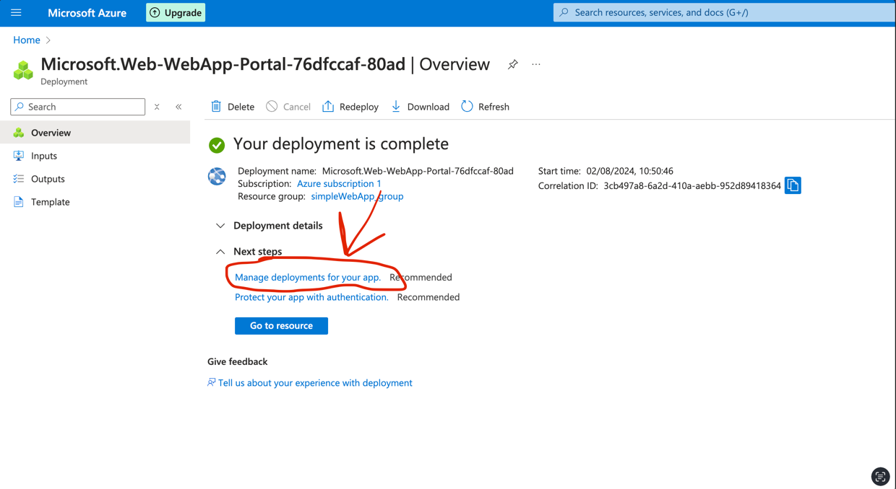
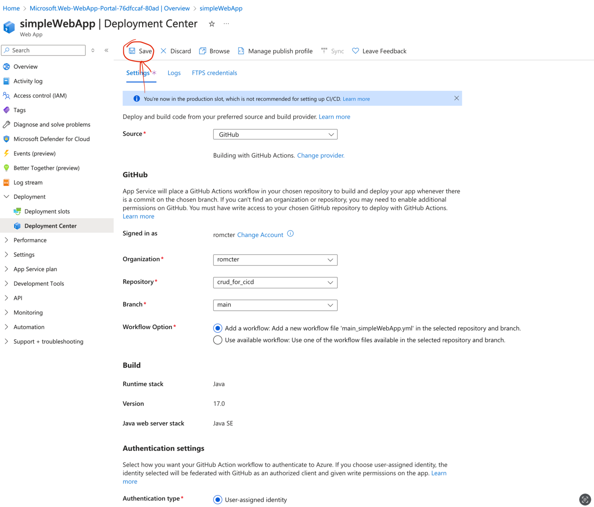
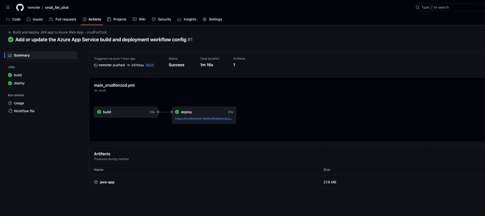
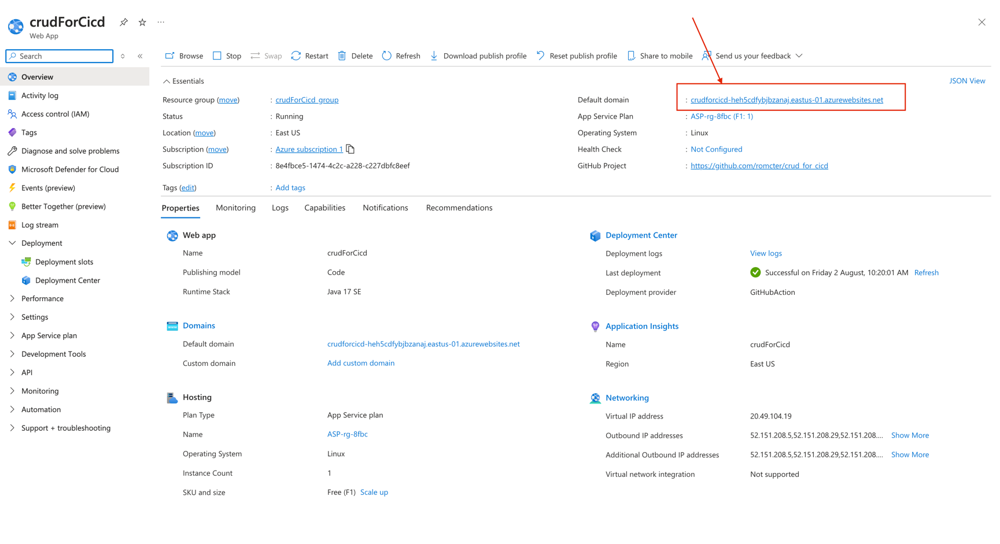
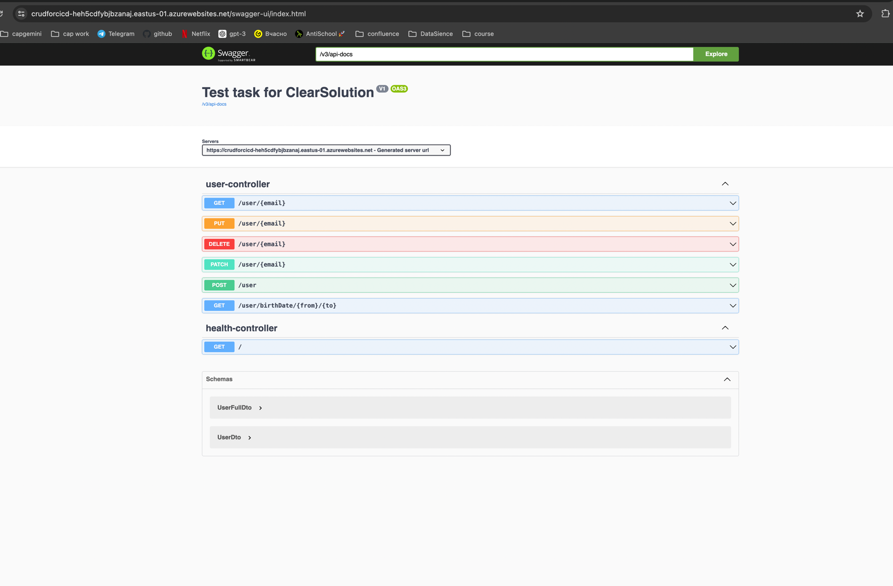

### [Link to swagger](https://crudforcicd-heh5cdfybjbzanaj.eastus-01.azurewebsites.net/swagger-ui/index.html)
## Tolls
- Cloud Provider: Microsoft Azure
- VCS: GitHub

## Steps
1) ### Create GitHub Repo (with some crud app)
2) ### App Services -> Create

3) ### Setup deployment

4) ### Go to github repo -> Action

5) ### This is yor link to app

